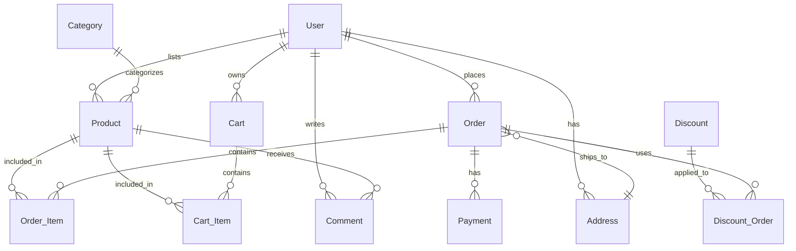
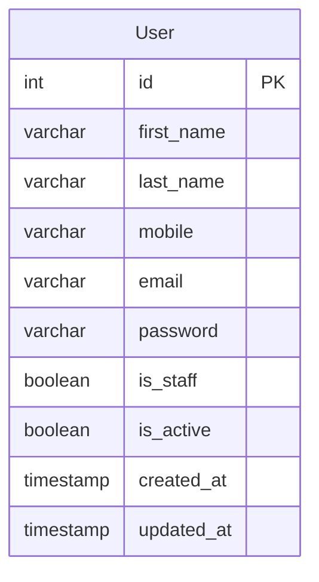
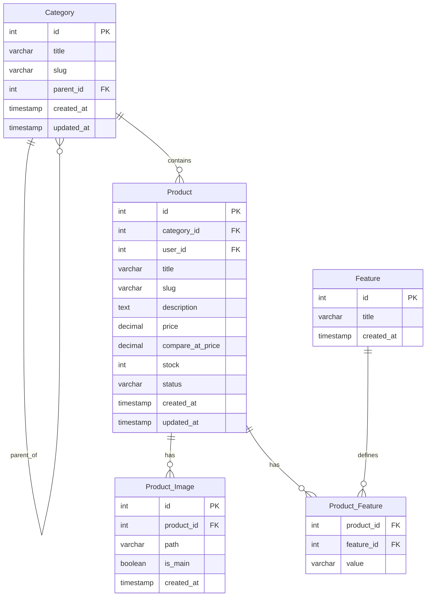
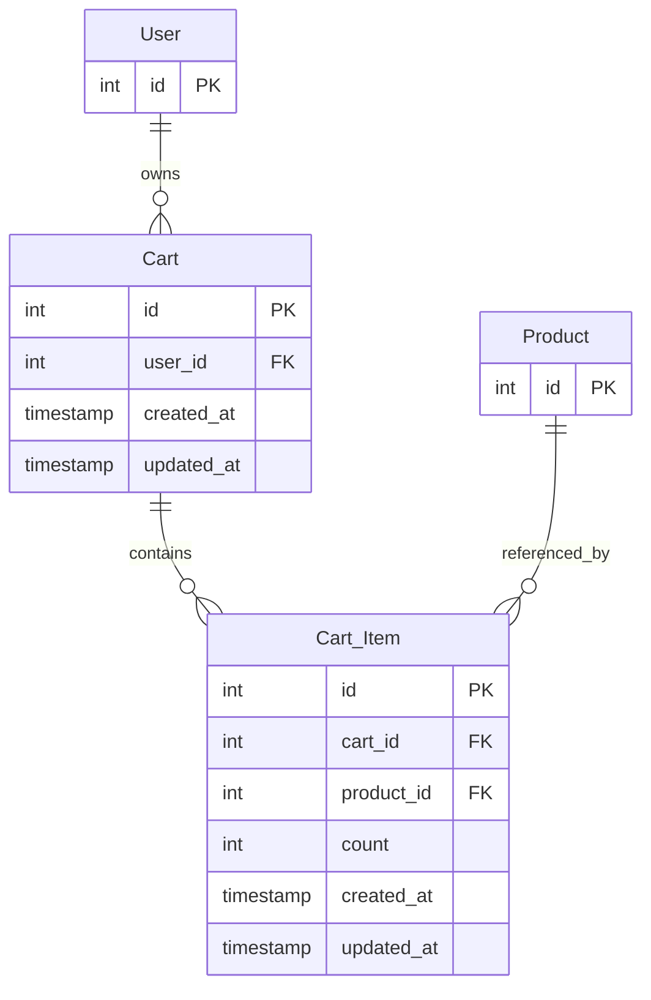
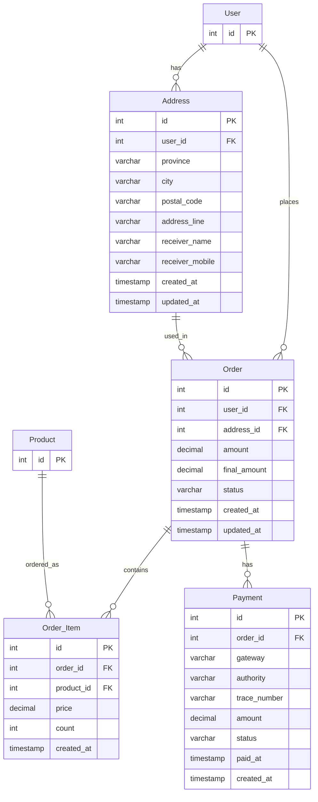
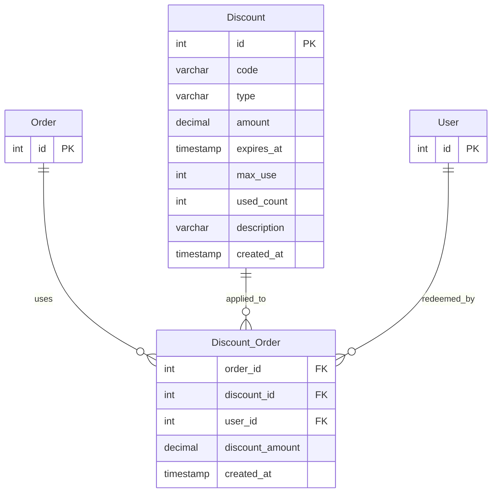
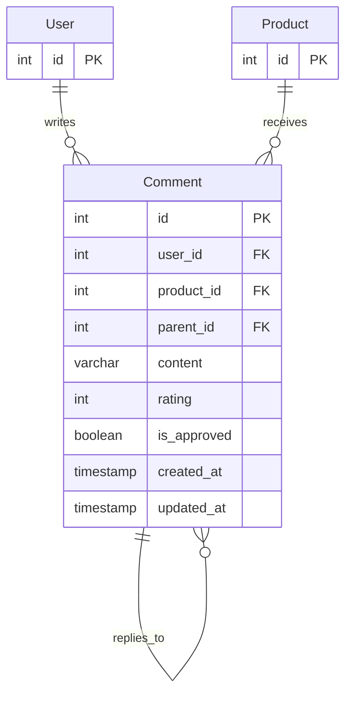

<div dir="rtl">

# معماری دیتابیس

این معماری دیتابیس با هدف پوشش کامل نیازهای یک فروشگاه اینترنتی در مقیاس کوچک تا متوسط
طراحی شده است و میتواند در این سطح تمامی نیاز های یک فروشگاه را تامین کند.

---

# نمای کلی دیتابیس



---

# ۱. مدیریت کاربر و دسترسی



### توضیح تصمیم

- `is_staff` مشخص می‌کند کاربر به پنل مدیریت دسترسی دارد یا نه (معادل توکار Django).
- `is_superuser` هم به‌صورت توکار در Django موجود است و نیازی به تعریف دستی ندارد
  (در دیاگرام برای اختصار نیامده).

---

# ۲. مدیریت محصول



### وضعیت محصول

<div dir="ltr">

```text
draft         = پیش‌نویس، هنوز منتشر نشده
active        = فعال و قابل خرید
out_of_stock  = موجودی تمام شده (stock = 0)
archived      = بایگانی‌شده / دیگر فروخته نمی‌شود
```

</div>

---

# ۳. سبد خرید (Cart)



---

# ۴. مدیریت سفارش



### وضعیت سفارش

<div dir="ltr">

```text
pending      = در انتظار پرداخت
paid         = پرداخت‌شده
processing   = در حال آماده‌سازی
shipped      = ارسال‌شده
delivered    = تحویل داده‌شده
cancelled    = لغوشده
refunded     = مبلغ بازگردانده‌شده
```

</div>

### وضعیت پرداخت

<div dir="ltr">

```text
pending  = در انتظار تایید درگاه
success  = موفق
failed   = ناموفق
```

</div>

---

# ۵. مدیریت تخفیف



---

# ۶. نظرات و امتیازدهی



---

# ۷. فهرست کامل موجودیت‌ها

| حوزه           | موجودیت‌ها                                                 |
| -------------- | ---------------------------------------------------------- |
| کاربر و دسترسی | super_user                                                 |
| آدرس           | Address                                                    |
| محصول          | Category, Product, Product_Image, Feature, Product_Feature |
| سبد خرید       | Cart, Cart_Item                                            |
| سفارش          | Order, Order_Item, Payment                                 |
| تخفیف          | Discount, Discount_Order                                   |
| نظرات          | Comment                                                    |

---

# ۸. تصمیمات مهم طراحی

## کلید خارجی و یکپارچگی ارجاعی

تمام روابط با Foreign Key پیاده‌سازی می‌شوند.

## قیدهای یکتایی مهم (Unique Constraints)

این‌ها نکاتی هستند که در نسخه‌ی قبلی به‌صراحت ذکر نشده بودند ولی برای صحت داده حیاتی‌اند:

<div dir="ltr">

```text
User.mobile          → باید یکتا باشد
User.email           → باید یکتا باشد
Product.slug         → باید یکتا باشد
Category.slug        → باید یکتا باشد
Discount.code        → باید یکتا باشد
(Discount_Order.discount_id, Discount_Order.user_id) → باید یکتا باشد
```

</div>

## تراکنش‌ها (Transactions)

عملیات ثبت سفارش باید اتمیک (Atomic) باشد:

```text
ایجاد سفارش → ایجاد اقلام سفارش → کاهش موجودی → Commit
(در صورت خطا در هر مرحله → Rollback کامل)
```

## هم‌زمانی موجودی انبار

<div dir="ltr">

```sql
UPDATE Product
SET stock = stock - 1
WHERE id = $1
AND stock > 0;
```

</div>

---

# ۹. PostgreSQL

PostgreSQL دیتابیس اصلی و Redis برای کش/Session/Rate-limiting استفاده می‌شود.

---

</div>
